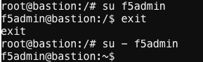

# NGINX Gateway Fabric (NGF)

Welcome to this NGINX Gateway Fabric (NGF) project where we explore and demonstrate different use
cases. 

### Note: NGINX Gateway Fabric is already installed; this is not an installation lab.

We will be providing labs based on published use cases supported by the NGINX Gateway Fabric **stable** release.

Features only found in the **edge** release are **not**  included in this content.

The NGINX Gateway Fabric leverages the NGINX web server as a proxy for traffic into a Kubernetes cluster.  The NGINX Gateway Fabric includes a standard Kubernetes controller **container** that consumes yaml and produces an NGINX.conf file that is pushed to the NGINX Gateway Fabric NGINX web server **container**.

### Environment

The live environment you will be using will be based on the
[SDE NGINX Gateway Fabric UDF Blueprint](https://udf.f5.com/b/d2617e7e-018f-4c9a-a15f-09ca55ae8a37#documentation). Create and start a deployment
if you have not already done so.

>**Note**: Starting the lab can take approximately 5 minutes

* You can access these instances via SSH from your local computer. The [UDF Accessing a component via SSH](https://help.udf.f5.com/en/articles/3347769-accessing-a-component-via-ssh)
article describes configuration steps to allow that.
* The UDF lab leverages [Metallb](https://metallb.universe.tf) to provide the **LoadBalancer** Kubernetes Service.
* The UDF lab also includes a deployed recent version of NGINX Gateway Fabric is installed.
* When using the WebShell login option be sure to become the **f5admin** user using `su - f5admin`.  The dash "-" is important in this example as it ensure you have a clean login as the **f5admin** user and start in the **f5admin** users home directory and not the **root** home directory.  

### Credits:
This lab guide is authored by the F5 NPI Team a.glanville@f5.com and t.thomas@f5.com and john.wong@f5.com
The main copy of this lab guide is stored on the F5 private Gitlab behind the F5 VPN and is linked to from the UDF description. This lab guide stored in this GitHub repo is the beginnings of a resource for building training for customers, partners, and others where access to the F5 VPN may be difficult and where rapid updates can be made to this lab without using F5 Gitlab. 

## Lab Use Cases ( Lab Modules )

In this lab, you will be completing the Use Cases aka Lab Modules.
Each Use Case will consist of a Demo, Lab, and Fix it.

* Demo: Instructor will drive.
* Interactive Lab: You are expected configure and validate a use case.
* Fix It: You are given a broken configuration and you are expected to fix the issue.

### Complete these Lab Modules/Use Cases, in order.
* [Kubernetes Environment Exploration and Validation](../main/validation-and-troubleshooting/README.md)
* [Basic Pods and Services Creation](clusterip-nodeport-loadbalancer.md) 
* [Basic Host and Path-based Routing](use-case1-host-and-path-routing/README.md)
* [Cross Namespace Routing](use-case2-cross-namespace-routing/README.md)
* [Modify Request Headers](use-case3-mod-req-headers/README.md)
* [HTTPS Termination](use-case4-https-termination/README.md)
* [Advanced Routing and Split Traffic Connections](use-case5-and-6-advanced-routing-traffic-splitting/README.md)

## ---------------- end of main lab section ----------------------

### Bonus Labs

These first two use cases were merged into one use case.  However, you may find some unique content here that is of interest.

* [Advanced Routing](../main/bonus-labs/case5-advanced-routing/README.md)
* [Traffic Splitting](../main/bonus-labs/case6-split-traffic-connections/README.md)

This bonus lab provides an example of how to use one Gateway with two namespaces and one HTTPRoute.

* [Gateways and Routes](./bonus-labs/gateways-and-routes/README.md)

## Note on Installing NGINX Gateway Fabric

>**Note**: You do **NOT** need to install NGINX Gateway Fabric when using the SDE UDF lab designed for this Up Skilling session.

The installation of the NGINX Gateway Fabric is simple and straightforward.  You can find the documentation for the process on the [NGINX docs](https://docs.nginx.com/nginx-gateway-fabric/installation/) site. 

You can install NGINX Gateway Fabric using manifest charts or using helm.  Using either method you must install the CRDs for the NGINX Gateway Fabric first.​

There are sample configurations available in the [NGINX Gateway Fabric Github repository](https://github.com/nginxinc/nginx-gateway-fabric/tree/release-1.3/examples).

## Additional Resources

For more information on the Kubernetes Gateway API and the NGINX Gateway Fabric, consider the
following resources:

* [Kubernetes Gateway API](https://gateway-api.sigs.k8s.io/)
* [Kubernetes HTTPRoute](https://gateway-api.sigs.k8s.io/reference/spec/#gateway.networking.k8s.io%2fv1.HTTPRoute)
* [NGINX Gateway Fabric Documentation](https://docs.nginx.com/nginx-gateway-fabric)
* [NGINX Gateway Fabric Technical Specifications: supported software versions](https://github.com/nginxinc/nginx-gateway-fabric#technical-specifications)
* [NGINX Gateway Fabric API Reference](https://docs.nginx.com/nginx-gateway-fabric/reference/api/)
* [Kubernetes.io overview of the Gateway API](https://kubernetes.io/docs/concepts/services-networking/gateway/)

___
___
