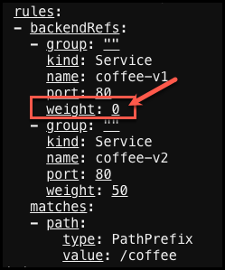

# Coffee demo with traffic splitting

## Introduction

In this demo we are going to deploy the [Coffee application and service](coffee.yaml) to the default namespace. This Coffee application actually creates two deployments, one called **coffee-v1** and the other **coffee-v2**.  The gateway object and HTTPRoute will be deployed to the default namespace also. This is a task that might be completed by the **Applications Developer**.

Copy and paste the following code snippet to deploy the coffee application and service.

```yaml
kubectl create -f - <<EOF
apiVersion: apps/v1
kind: Deployment
metadata:
  name: coffee-v1
spec:
  replicas: 1
  selector:
    matchLabels:
      app: coffee-v1
  template:
    metadata:
      labels:
        app: coffee-v1
    spec:
      containers:
      - name: coffee-v1
        image: nginxdemos/nginx-hello:plain-text
        ports:
        - containerPort: 8080
---
apiVersion: v1
kind: Service
metadata:
  name: coffee-v1
spec:
  ports:
  - port: 80
    targetPort: 8080
    protocol: TCP
    name: http
  selector:
    app: coffee-v1
---
apiVersion: apps/v1
kind: Deployment
metadata:
  name: coffee-v2
spec:
  replicas: 1
  selector:
    matchLabels:
      app: coffee-v2
  template:
    metadata:
      labels:
        app: coffee-v2
    spec:
      containers:
      - name: coffee-v2
        image: nginxdemos/nginx-hello:plain-text
        ports:
        - containerPort: 8080
---
apiVersion: v1
kind: Service
metadata:
  name: coffee-v2
spec:
  ports:
  - port: 80
    targetPort: 8080
    protocol: TCP
    name: http
  selector:
    app: coffee-v2
EOF
```

Now check your new pod and service in the **default** namespace.

```bash
kubectl get pod,svc -owide
```

<details>
  <summary><h3>Example output</h3></summary>

  ```bash
  f5admin@bastion:~$ kubectl get pod,svc -owide
NAME                             READY   STATUS    RESTARTS   AGE   IP              NODE                    NOMINATED NODE   READINESS GATES
pod/coffee-v1-76c7c85bbd-lwnn4   1/1     Running   0          17s   10.244.67.147   w1-mgmt.lab.f5npi.net   <none>           <none>
pod/coffee-v2-7d47fc86cb-lflhk   1/1     Running   0          17s   10.244.67.148   w1-mgmt.lab.f5npi.net   <none>           <none>

NAME                 TYPE        CLUSTER-IP       EXTERNAL-IP   PORT(S)   AGE   SELECTOR
service/coffee-v1    ClusterIP   10.104.172.246   <none>        80/TCP    17s   app=coffee-v1
service/coffee-v2    ClusterIP   10.105.78.161    <none>        80/TCP    16s   app=coffee-v2
service/kubernetes   ClusterIP   10.96.0.1        <none>        443/TCP   9d    <none>
  ```
</details>

Then we will create an [NGINX Gateway Fabric gateway](gateway.yaml) object that will enable traffic into the default namespace based on the following criteria.

| Name                   | Value     |
| ---------------------- | -------   |
| **port**               | `80`      |
| **protocol**           | `HTTP` |
| **hostname**           | `coffee.lab.f5npi.net`   |

This could be the responsibility of the **cluster administrator**.

Copy and paste the following code snippet to deploy the coffee gateway.

```yaml
kubectl create -f - <<EOF
apiVersion: gateway.networking.k8s.io/v1
kind: Gateway
metadata:
  name: cafe-gateway
spec:
  gatewayClassName: nginx
  listeners:
  - name: http
    port: 80
    protocol: HTTP
    hostname: coffee.lab.f5npi.net
EOF
```

Check the new cafe-gateway health.

```bash
kubectl get gateways cafe-gateway
kubectl describe gateways cafe-gateway
```

<details>
  <summary><h3>Example output</h3></summary>

  ```bash
  f5admin@bastion:~$ kubectl get gateways cafe-gateway
NAME           CLASS   ADDRESS       PROGRAMMED   AGE
cafe-gateway   nginx   10.1.10.100   True         27s

f5admin@bastion:~$ kubectl describe gateways cafe-gateway
Name:         cafe-gateway
Namespace:    default
Labels:       <none>
Annotations:  <none>
API Version:  gateway.networking.k8s.io/v1
Kind:         Gateway
Metadata:
  Creation Timestamp:  2024-07-15T21:11:52Z
  Generation:          1
  Resource Version:    121761
  UID:                 27e21ddf-3c47-4189-aa4e-d37eb32fdacb
Spec:
  Gateway Class Name:  nginx
  Listeners:
    Allowed Routes:
      Namespaces:
        From:  Same
    Hostname:  coffee.lab.f5npi.net
    Name:      http
    Port:      80
    Protocol:  HTTP
Status:
  Addresses:
    Type:   IPAddress
    Value:  10.1.10.100
  Conditions:
    Last Transition Time:  2024-07-15T21:11:53Z
    Message:               Gateway is accepted
    Observed Generation:   1
    Reason:                Accepted
    Status:                True
    Type:                  Accepted
    Last Transition Time:  2024-07-15T21:11:53Z
    Message:               Gateway is programmed
    Observed Generation:   1
    Reason:                Programmed
    Status:                True
    Type:                  Programmed
  Listeners:
    Attached Routes:  0
    Conditions:
      Last Transition Time:  2024-07-15T21:11:53Z
      Message:               Listener is accepted
      Observed Generation:   1
      Reason:                Accepted
      Status:                True
      Type:                  Accepted
      Last Transition Time:  2024-07-15T21:11:53Z
      Message:               Listener is programmed
      Observed Generation:   1
      Reason:                Programmed
      Status:                True
      Type:                  Programmed
      Last Transition Time:  2024-07-15T21:11:53Z
      Message:               All references are resolved
      Observed Generation:   1
      Reason:                ResolvedRefs
      Status:                True
      Type:                  ResolvedRefs
      Last Transition Time:  2024-07-15T21:11:53Z
      Message:               No conflicts
      Observed Generation:   1
      Reason:                NoConflicts
      Status:                False
      Type:                  Conflicted
    Name:                    http
    Supported Kinds:
      Group:  gateway.networking.k8s.io
      Kind:   HTTPRoute
Events:       <none>

  ```
</details>


Next we will create the [HTTPRoute](coffee-httpRoute.yaml) that will add weighting to the distribution of traffic to the backend PODs.  The key value here is **weight** which is based on a percent of 100. The httpRoute object will also define the path uri of **/coffee** and backend service (POD) to route traffic to.  This could be the responsibility of the **Application Developer**.

>**Note**: Weight is an optional parameter and if not specified, defaults to 1. The weights are calculated proportionally and do not need to sum to 100. For example, the weights of 8 and 2, 16 and 4, or 32 and 8 all evaluate to the same relative proportions.

Copy and paste the following code snippet to deploy the HTTPRoute for the hats application.

```yaml
kubectl create -f - <<EOF
apiVersion: gateway.networking.k8s.io/v1
kind: HTTPRoute
metadata:
  name: coffee-httproute
spec:
  parentRefs:
  - name: cafe-gateway
    sectionName: http
  hostnames:
  - "coffee.lab.f5npi.net"
  rules:
  - matches:
    - path:
        type: PathPrefix
        value: /coffee
    backendRefs:
    - name: coffee-v1
      port: 80
      weight: 80
    - name: coffee-v2
      port: 80
      weight: 20
EOF
```

Check the new httpRoute health.

```bash
kubectl get httproutes coffee-httproute
kubectl describe httproutes coffee-httproute
```

<details>
  <summary><h3>Example output</h3></summary>

  ```bash
  f5admin@bastion:~$ kubectl get httproutes coffee-httproute
NAME               HOSTNAMES                  AGE
coffee-httproute   ["coffee.lab.f5npi.net"]   21s
  ```
</details>

## Testing

Now test your newly exposed application using the **NGINX Gateway Fabric HTTPRoute** we just deployed that is linked to the **cafe-gateway** object.  We should find that our connections are distributed evenly between the two versions.

```bash
curl coffee.lab.f5npi.net/coffee
```
<details>
  <summary><h3>Example output</h3></summary>

  ```bash
f5admin@bastion:~$ curl coffee.lab.f5npi.net/coffee
Server address: 10.244.67.148:8080
Server name: coffee-v2-7d47fc86cb-lflhk
Date: 15/Jul/2024:21:17:09 +0000
URI: /coffee
Request ID: 2b6111c300d5a7dce7611eddfa3fc491
f5admin@bastion:~$ curl coffee.lab.f5npi.net/coffee
Server address: 10.244.67.147:8080
Server name: coffee-v1-76c7c85bbd-lwnn4
Date: 15/Jul/2024:21:17:10 +0000
URI: /coffee
Request ID: 184704a9a64001971a3357dae47683e8
f5admin@bastion:~$ curl coffee.lab.f5npi.net/coffee
Server address: 10.244.67.148:8080
Server name: coffee-v2-7d47fc86cb-lflhk
Date: 15/Jul/2024:21:17:12 +0000
URI: /coffee
Request ID: 348a1225c76c253b635b7102f6ca3c1c
f5admin@bastion:~$ curl coffee.lab.f5npi.net/coffee
Server address: 10.244.67.147:8080
Server name: coffee-v1-76c7c85bbd-lwnn4
Date: 15/Jul/2024:21:17:13 +0000
URI: /coffee
  ```
</details>


## Disable coffee-v1

Now we are going to edit the weight for coffee-v1 and disable this service and the related PODs.  We will do this by changing the weight value to 0 for coffee-v1.

```bash
kubectl edit httproutes coffee-httproute
```



Now test your connections again and you should notice that you are only being routed to coffee-v2.

```bash
curl coffee.lab.f5npi.net/coffee
```

<details>
  <summary><h3>Example output</h3></summary>

  ```bash
f5admin@bastion:~$ curl coffee.lab.f5npi.net/coffee
Server address: 10.244.67.148:8080
Server name: coffee-v2-7d47fc86cb-lflhk
Date: 15/Jul/2024:21:24:15 +0000
URI: /coffee
Request ID: 9e0c42773d66b19d76a80fe6fd128b8e
f5admin@bastion:~$ curl coffee.lab.f5npi.net/coffee
Server address: 10.244.67.148:8080
Server name: coffee-v2-7d47fc86cb-lflhk
Date: 15/Jul/2024:21:24:17 +0000
URI: /coffee
Request ID: d02cc94c353291eae5251096d218b9da
f5admin@bastion:~$ curl coffee.lab.f5npi.net/coffee
Server address: 10.244.67.148:8080
Server name: coffee-v2-7d47fc86cb-lflhk
Date: 15/Jul/2024:21:24:18 +0000
URI: /coffee
Request ID: 09f8d3d1dac21c39cbb74d8723510695
f5admin@bastion:~$ curl coffee.lab.f5npi.net/coffee
Server address: 10.244.67.148:8080
Server name: coffee-v2-7d47fc86cb-lflhk
Date: 15/Jul/2024:21:24:19 +0000
URI: /coffee
Request ID: 32eb940ec49ea5b41a99876a4ee7ad87
  ```
</details>
## Clean up

When done with this lab you can clean up the objects by running the following commands.

```bash
kubectl delete deployments.apps coffee-v1 coffee-v2
kubectl delete service coffee-v1 coffee-v2
kubectl delete gateways cafe-gateway
kubectl delete httproutes.gateway coffee-httproute
```

>**Note**: If you would prefer to manually create and deploy the configurations you can find the source YAML files here:

- [Coffee applications and services](coffee-v1-and-v2.yaml)
- [Cafe Gateway](cafe-gateway.yaml)
- [Coffee route with 50/50 weighting](coffee-50-50-httpRoute.yaml)

Previous: [SDE NGINX Gateway Fabric](../README.md)

Next: [Interactive Lab](../lab/README.md)

---

## End of lab
