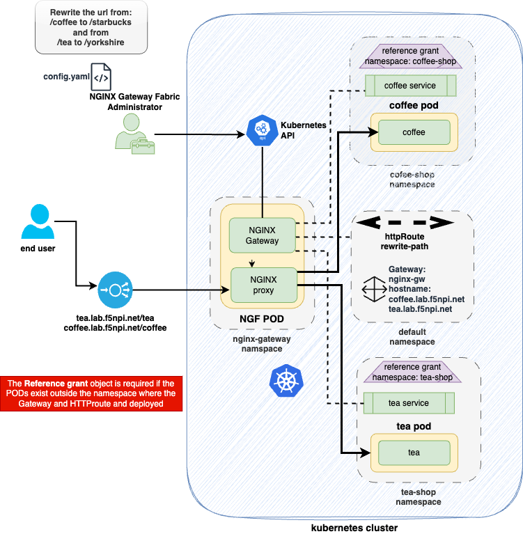

# Bonus Lab

This lab can be completed at any time.  This lab is not part of the standard Up Skilling agenda.  This lab is provided for individuals that are looking for additional content based on the NGINX Gateway Fabric.  

## Introduction

This lab will demonstrate an environment with one gateway that supports two namespaces.  This lab will also demonstrate how we can use one HTTPRoute to direct traffic to either **/coffee** and **/tea.**  Finally this lab also demonstrates how to rewrite the url from **/coffee** to **/starbucks** and **/tea** to **/yorkshire**.

<details>
  <summary><b>Lab diagram overview</b></summary>

 

</details>


## Lab

Copy and paste the following code snippet to deploy the coffee web and tea applications and services into their own namespaces **coffee-shop** and **tea-shop**.

> If you prefer to manually create this application, click [here](coffee-and-tea.yaml) for the YAML file.

```bash
kubectl create -f - <<EOF
---
apiVersion: v1
kind: Namespace
metadata:
  name: coffee-shop
---
apiVersion: apps/v1
kind: Deployment
metadata:
  name: coffee
  namespace: coffee-shop
spec:
  replicas: 1
  selector:
    matchLabels:
      app: coffee
  template:
    metadata:
      labels:
        app: coffee
    spec:
      containers:
      - name: coffee
        image: nginxdemos/nginx-hello:plain-text
        ports:
        - containerPort: 8080
---
apiVersion: v1
kind: Service
metadata:
  name: coffee
  namespace: coffee-shop
spec:
  ports:
  - port: 80
    targetPort: 8080
    protocol: TCP
    name: http
  selector:
    app: coffee
---
apiVersion: v1
kind: Namespace
metadata:
  name: tea-shop
---
apiVersion: apps/v1
kind: Deployment
metadata:
  name: tea
  namespace: tea-shop
spec:
  replicas: 1
  selector:
    matchLabels:
      app: tea
  template:
    metadata:
      labels:
        app: tea
    spec:
      containers:
      - name: tea
        image: nginxdemos/nginx-hello:plain-text
        ports:
        - containerPort: 8080
---
apiVersion: v1
kind: Service
metadata:
  name: tea
  namespace: tea-shop
spec:
  ports:
  - port: 80
    targetPort: 8080
    protocol: TCP
    name: http
  selector:
    app: tea
EOF
```

Now check your new pods and services

```bash
kubectl -n coffee-shop get pod,svc -owide
kubectl -n tea-shop get pod,svc -owide
```

<details>
  <summary><b>Example output</b></summary>

```bash
  f5admin@bastion:~$ kubectl -n tea-shop get pods,svc -o wide
NAME                      READY   STATUS    RESTARTS   AGE    IP               NODE                    NOMINATED NODE   READINESS GATES
pod/tea-9d8868bb4-kl6bw   1/1     Running   0          102m   10.244.191.155   w3-mgmt.lab.f5npi.net   <none>           <none>

NAME          TYPE        CLUSTER-IP       EXTERNAL-IP   PORT(S)   AGE    SELECTOR
service/tea   ClusterIP   10.103.244.172   <none>        80/TCP    102m   app=tea
f5admin@bastion:~$ 
```

</details>

Then we will create an NGINX Gateway Fabric gateway object that with two listeners one called http-tea and the other called http-coffee. 

| Property      | Values                 |
| ------------- | ---------------------- |
| name          | `http-tea`             |
| port          | `80`                   |
| protocol      | `TCP`                  |
| hostname      | `tea.lab.f5npi.net`       |
| name          | `http-coffee`             |
| port          | `80`                   |
| protocol      | `TCP`                  |
| hostname      | `coffee.lab.f5npi.net`       |


> If you prefer to manually create this, click [here](gateway.yaml) for the YAML file.

```bash
kubectl create -f - <<EOF
apiVersion: gateway.networking.k8s.io/v1
kind: Gateway
metadata:
  name: nginx-gw
spec:
  gatewayClassName: nginx
  listeners:
    - name: http-tea
      hostname: "tea.lab.f5npi.net"
      port: 80
      protocol: HTTP
    - name: http-coffee
      hostname: "coffee.lab.f5npi.net"
      port: 80
      protocol: HTTP
EOF
```

Check the new service.

```bash
kubectl get gateways nginx-gw 
```

<details>
  <summary><b>Example output</b></summary>

  ```bash
  f5admin@bastion:~$ kubectl get gateways nginx-gw 
NAME       CLASS   ADDRESS       PROGRAMMED   AGE
nginx-gw   nginx   10.1.10.100   True         85m
  ```

</details>

Next we will create **HTTPRoute** that will allow traffic inbound to our coffee and tea applications.  In addition this HTTPRoute will rewrite the URL from /coffee to / and /tea to /.

> If you prefer to manually create the HTTRoute, click [here](httpRoute.yaml) for the YAML file.


```bash
kubectl create -f - <<EOF
apiVersion: gateway.networking.k8s.io/v1
kind: HTTPRoute
metadata:
  name: rewrite-path
spec:
  parentRefs:
  - name: nginx-gw
    namespace: default
    sectionName: http-coffee
  - name: nginx-gw
    namespace: default
    sectionName: http-tea
  hostnames:
  - "tea.lab.f5npi.net"
  - "coffee.lab.f5npi.net"
  rules:
  - matches:
    - path:
        type: PathPrefix
        value: /tea
      headers:
      - name: "Host"
        value: "tea.lab.f5npi.net"
    filters:
    - type: URLRewrite
      urlRewrite:
        path:
          type: ReplacePrefixMatch
          replacePrefixMatch: /yorkshire
    backendRefs:
    - name: tea
      namespace: tea-shop
      port: 80
  - matches:
    - path:
        type: PathPrefix
        value: /coffee
      headers:
      - name: "Host"
        value: "coffee.lab.f5npi.net"
    filters:
    - type: URLRewrite
      urlRewrite:
        path:
          type: ReplacePrefixMatch
          replacePrefixMatch: /starbucks
    backendRefs:
    - name: coffee
      namespace: coffee-shop
      port: 80
EOF
```

Now you can check on the status of your new httpRoute rule.

```bash
kubectl get httproutes rewrite-path
```

<details>
  <summary><b>Example output</b></summary>

```bash
f5admin@bastion:~$ kubectl get httproutes rewrite-path 
NAME           HOSTNAMES                                      AGE
rewrite-path   ["tea.lab.f5npi.net","coffee.lab.f5npi.net"]   101m
```

</details>

## Creating the Reference Grants

Next we will create the reference Grants that will allow NGINX Gateway Fabric to configure routing for the **coffee-shop** and **tea-shop** namespaces.

```yaml
kubectl create -f - <<EOF
apiVersion: gateway.networking.k8s.io/v1beta1
kind: ReferenceGrant
metadata:
  name: access-to-tea-shop
  namespace: tea-shop
spec:
  to:
  - group: ""
    kind: Service
  from:
  - group: gateway.networking.k8s.io
    kind: HTTPRoute
    namespace: default
---
apiVersion: gateway.networking.k8s.io/v1beta1
kind: ReferenceGrant
metadata:
  name: access-to-coffee-shop
  namespace: coffee-shop
spec:
  to:
  - group: ""
    kind: Service
  from:
  - group: gateway.networking.k8s.io
    kind: HTTPRoute
    namespace: default
EOF
```

## Test application

Now we can test the newly exposed applications using the curl. Notice the url value that the container sees, it should not be /coffee or /tea.

```bash
curl http://tea.lab.f5npi.net/tea
```

```bash
curl http://coffee.lab.f5npi.net/coffee
```

<details>
  <summary><b>Example output</b></summary>

```bash
f5admin@bastion:~$ curl http://tea.lab.f5npi.net/tea
Server address: 10.244.82.176:8080
Server name: tea-9d8868bb4-qljhp
Date: 26/Jul/2024:20:41:30 +0000
URI: /yorkshire
Request ID: a666666382e589f551a2e66e2c2a73e1
f5admin@bastion:~$ curl http://coffee.lab.f5npi.net/coffee
Server address: 10.244.82.175:8080
Server name: coffee-6b8b6d6486-kdglz
Date: 26/Jul/2024:20:41:39 +0000
URI: /starbucks
Request ID: ad77eed5d89f6fe9fee802b87e5141ab
f5admin@bastion:~$ 
```

</details>

## Clean up

When you are done with this lab, clean up the objects by running the following commands.

```bash
kubectl delete -n coffee-shop deployments.apps coffee
kubectl delete -n tea-shop deployments.apps tea
kubectl delete -n coffee-shop service coffee
kubectl delete -n tea-shop service tea
kubectl delete httproutes rewrite-path
kubectl delete gateways nginx-gw
kubectl -n coffee-shop delete referencegrants access-to-coffee-shop
kubectl -n tea-shop delete referencegrants access-to-tea-shop
kubectl delete namespaces tea-shop coffee-shop
```

## Source files

Here are the configuration files in the event that you want to manually go through this lab.

- [Coffee and Tea shops](coffee-and-tea.yaml)
- [Gateway](gateway.yaml)
- [HTTPRoute](HTTPRoute.yaml)
- [Reference Grants](referenceGrants.yaml)

Return to the NGF landing page: [NGF Home](../../README.md)

---

## End of lab
