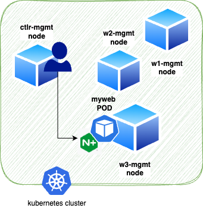
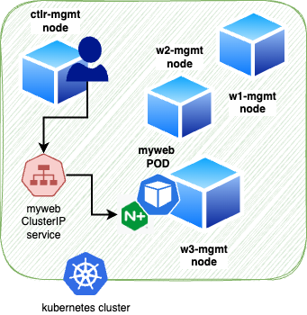
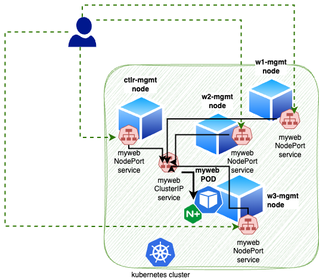
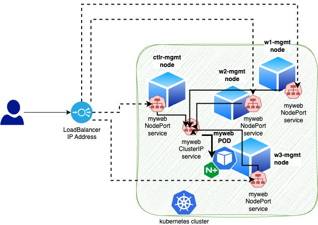

# The Cluster

Take a quick look at the IP Addresses for your Nodes in your Cluster:

```bash
kubectl get nodes -owide
```

# Basic Kubernetes Deployment

First we create a basic nginx deployment.



The actual creation time should be less than a minute, you may see `ContainerCreating` you may need to wait a few more seconds for the process to complete.

```bash
kubectl create deployment myweb --image=nginx --port=80
```
```bash
kubectl get pods -o wide
```

<details>
  <summary><b>Example output</b></summary>

```bash
f5admin@bastion:~$ kubectl create deployment myweb --image=nginx --port=80
deployment.apps/myweb created
f5admin@bastion:~$ kubectl get pods -o wide
NAME                     READY   STATUS    RESTARTS   AGE   IP              NODE                    NOMINATED NODE   READINESS GATES
myweb-68fc94d654-mc5tz   1/1     Running   0          10s   10.244.67.143   w1-mgmt.lab.f5npi.net   <none>           <none>
```

</details>

Try to curl to your POD IP from the Bastion Host. **Note** this is expected to fail.

>**Note**: Your POD IP address will most likely be different than what is shown in the following example.

```bash
curl -m 3 10.244.67.143
```
Why did this fail? Because this ip is not exposed outside the cluster.

Try to curl to one of your Node IP's from the Bastion Host. **Note** this is expected to fail.


```bash
kubectl get nodes -owide
```
```bash
curl -m 3 10.1.10.7
```

Why did this fail? Because this is just the IP Address of the Node, and there is no NodePort service for this deployment.


So how can you test this basic NGINX web server? You have to go into the cluster, and generate a request from one of the nodes in the cluster.  This pod has no service defined and as such is only available from within the Kubernetes cluster using the POD IP Address.

```bash
ssh ctlr-mgmt.lab.f5npi.net
```
```bash
curl 10.244.67.143
```

<details>
  <summary><b>Example output</b></summary>

```bash
f5admin@bastion:~$ ssh ctlr-mgmt.lab.f5npi.net
Activate the web console with: systemctl enable --now cockpit.socket

Last login: Mon Jul 15 23:02:04 2024 from 10.1.1.11
[f5admin@ctlr-mgmt ~]$ curl 10.244.67.143
<!DOCTYPE html>
<html>
<head>
<title>Welcome to nginx!</title>
<style>
html { color-scheme: light dark; }
body { width: 35em; margin: 0 auto;
font-family: Tahoma, Verdana, Arial, sans-serif; }
</style>
</head>
<body>
<h1>Welcome to nginx!</h1>
<p>If you see this page, the nginx web server is successfully installed and
working. Further configuration is required.</p>

<p>For online documentation and support please refer to
<a href="http://nginx.org/">nginx.org</a>.<br/>
Commercial support is available at
<a href="http://nginx.com/">nginx.com</a>.</p>

<p><em>Thank you for using nginx.</em></p>
</body>
</html>
```

</details>

Next we want to add a service for our myweb POD.  We know that a POD is ephemeral, something of beauty that is not supposed to live long. Anytime our myweb POD dies the replication controller, deployment controller and scheduler controller work together to ensure a replacement is brought on-line as soon as possible.

However, if we want something persistent then we need a service for the myweb deployment. The default service type is a ClusterIP service.  This service type is great for sharing services within the Kubernetes cluster, myweb could for example connect to mydatabase using a service and vice a versa.



Now we are going to create ClusterIP for our myweb deployment.  We want to do this work from the bastion host so we will exit the **ctlr-mgmt** node first.

```bash
exit
```
```bash
kubectl expose deployment myweb --port=80
```
```bash
kubectl get service myweb -owide
```

<details>
  <summary><b>Example output</b></summary>

```bash
[f5admin@ctlr-mgmt ~]$ exit
logout
Connection to ctlr-mgmt.lab.f5npi.net closed.
f5admin@bastion:~$ kubectl expose deployment myweb --port=80
service/myweb exposed
f5admin@bastion:~$ kubectl get service myweb -o wide
NAME    TYPE        CLUSTER-IP      EXTERNAL-IP   PORT(S)   AGE   SELECTOR
myweb   ClusterIP   10.101.177.48   <none>        80/TCP    12s   app=myweb
```

</details>
So is a ClusterIP accessible from outside the Cluster? Try to curl to your Cluster IP from the Bastion Host. **Note** this is expected to fail.

>**Note**: Your POD IP address will most likely be different than what is shown in the following example.

```bash
curl -m 3 10.244.67.143
```
Now again if we want to test our new ClusterIP service we have to do this from within the cluster so we will sign in to the ctlr-mgmt node again and test our service.

```bash
ssh ctlr-mgmt.lab.f5npi.net
```
```bash
curl 10.101.177.48
```
```bash
exit
```

<details>
  <summary><b>Example output</b></summary>

```bash
ssh ctlr-mgmt.lab.f5npi.net
```

Activate the web console with: 

```bash
systemctl enable --now cockpit.socket
```

Last login: Mon Jul 15 23:16:51 2024 from 10.1.1.11
[f5admin@ctlr-mgmt ~]$ curl http://10.101.177.48
<!DOCTYPE html>
<html>
<head>
<title>Welcome to nginx!</title>
<style>
html { color-scheme: light dark; }
body { width: 35em; margin: 0 auto;
font-family: Tahoma, Verdana, Arial, sans-serif; }
</style>
</head>
<body>
<h1>Welcome to nginx!</h1>
<p>If you see this page, the nginx web server is successfully installed and
working. Further configuration is required.</p>

<p>For online documentation and support please refer to
<a href="http://nginx.org/">nginx.org</a>.<br/>
Commercial support is available at
<a href="http://nginx.com/">nginx.com</a>.</p>

<p><em>Thank you for using nginx.</em></p>
</body>
</html>
[f5admin@ctlr-mgmt ~]$ exit
logout
Connection to ctlr-mgmt.lab.f5npi.net closed.
```

</details>

Now we are going to edit our **ClusterIP** service and change it to the **NodePort** service.  This type of service is really helpful to quickly enable access to a service from outside the Kubernetes Cluster. The **NodePort** service will expose a high level port on every Compute node in the cluster including the control plane that will connect to the myweb service. It is possible to setup a web server outside of the Kubernetes cluster and use the Node IP addresses and Port combination to define the upstream servers.  However, in this case the proxy server will need to come up with a method to determine if a node is offline or a new node comes on line. Generally this is a good option for developers but it is not commonly used for exposing services in production or to external customers.

You are now going to use Vi to edit the service. Fine ClusterIP and change to NodePort.

```bash
kubectl edit service myweb
```

Change the type from **ClusterIP** to **NodePort**, save your changes and exit.  

>**Note**: The default command line editor is Vim.

```bash
kubectl get service myweb 
```

<details>
  <summary><b>Example output</b></summary>

```bash
f5admin@bastion:~$ kubectl edit service myweb

# Please edit the object below. Lines beginning with a '#' will be ignored,
# and an empty file will abort the edit. If an error occurs while saving this file will be
# reopened with the relevant failures.
#
apiVersion: v1
kind: Service
metadata:
  creationTimestamp: "2024-07-15T23:37:03Z"
  labels:
    app: myweb
  name: myweb
  namespace: default
  resourceVersion: "448662"
  uid: ee55ad63-f887-41d5-976e-891f4082d526
spec:
  clusterIP: 10.104.37.252
  clusterIPs:
  - 10.104.37.252
  internalTrafficPolicy: Cluster
  ipFamilies:
  - IPv4
  ipFamilyPolicy: SingleStack
  ports:
  - port: 80
    protocol: TCP
    targetPort: 80
  selector:
    app: myweb
  sessionAffinity: None
  type: NodePort
status:
  loadBalancer: {}
~   
~
~
  "/tmp/kubectl-edit-3721243279.yaml" 34L, 782B written                                                                          
service/myweb edited

f5admin@bastion:~$ kubectl get service myweb 
NAME    TYPE       CLUSTER-IP      EXTERNAL-IP   PORT(S)        AGE
myweb   NodePort   10.104.37.252   <none>        80:31780/TCP   7m44s
```
</details>

This time we do NOT have to sign into a node in the cluster as each Node is now exposing a port on the external public IP for that node. You might also notice that we will have a ClusterIP defined in the service.  This is because the NodePort send requests to the ClusterIP which in turn sends the request to one of the available PODs.

This image is trying to show that relationship.



You can now test out this feature using one of the nodes public IP address on the NodePort value assigned by Kubernetes for the service.

>Note: Your NodePort port value may be different review the output from kubectl get services to find your port number.

```bash
kubectl get nodes -owide
```

**Note** There can be many servcies on a node listening on port 80. So instead of port 80, use the unique port for your service, 31780 in the example here.

```bash
curl 10.1.10.4:31:31780
```

<details>
  <summary><b>Example output</b></summary>

```bash
f5admin@bastion:~$ kubectl get nodes -owide
NAME                      STATUS   ROLES           AGE   VERSION   INTERNAL-IP   EXTERNAL-IP   OS-IMAGE         KERNEL-VERSION                CONTAINER-RUNTIME
ctlr-mgmt.lab.f5npi.net   Ready    control-plane   10d   v1.29.3   10.1.10.4     <none>        CentOS Linux 8   4.18.0-348.7.1.el8_5.x86_64   containerd://1.6.32
w1-mgmt.lab.f5npi.net     Ready    <none>          10d   v1.29.3   10.1.10.7     <none>        CentOS Linux 8   4.18.0-348.7.1.el8_5.x86_64   containerd://1.6.32
w2-mgmt.lab.f5npi.net     Ready    <none>          10d   v1.29.3   10.1.10.8     <none>        CentOS Linux 8   4.18.0-348.7.1.el8_5.x86_64   containerd://1.6.32
w3-mgmt.lab.f5npi.net     Ready    <none>          10d   v1.29.3   10.1.10.9     <none>        CentOS Linux 8   4.18.0-348.7.1.el8_5.x86_64   containerd://1.6.32
f5admin@bastion:~$ curl http://10.1.10.4:31780
<!DOCTYPE html>
<html>
<head>
<title>Welcome to nginx!</title>
<style>
html { color-scheme: light dark; }
body { width: 35em; margin: 0 auto;
font-family: Tahoma, Verdana, Arial, sans-serif; }
</style>
</head>
<body>
<h1>Welcome to nginx!</h1>
<p>If you see this page, the nginx web server is successfully installed and
working. Further configuration is required.</p>

<p>For online documentation and support please refer to
<a href="http://nginx.org/">nginx.org</a>.<br/>
Commercial support is available at
<a href="http://nginx.com/">nginx.com</a>.</p>

<p><em>Thank you for using nginx.</em></p>
</body>
</html>
```

</details>

The final transition is to **LoadBalancer**.  The **LoadBalancer** service is not part of the NGINX Gateway Fabric configuration.  The ability to request a **LoadBalancer** service is something that the Cloud provider such as Google, Azure, or Amazon would enable.  In our UDF lab environment we have configured [MetalLB](https://metallb.universe.tf/) to provide this service.  For the purpose of our discussion today it simply means that we have a service available in the environment that will provide an externally available IP address to your service to be used to expose your service as you see necessary.  The LoadBalancer service will use the NodePort IP Addresses and port values to enter the cluster.  The ClusterIP service will route traffic to the ClusterIP service that supports the myweb deployment and POD.

This image is trying to show that relationship.



Now we can edit our NodePort service and change it to a LoadBalancer service.  Once complete we should be able to find our newly assigned external LoadBalancer IP address and test our myweb deployment.

```bash
kubectl edit service myweb
kubectl get services myweb
curl http://10.1.10.101
```

<details>
  <summary><b>Example output</b></summary>

```bash
# Please edit the object below. Lines beginning with a '#' will be ignored,
# and an empty file will abort the edit. If an error occurs while saving this file will be
# reopened with the relevant failures.
#
apiVersion: v1
kind: Service
metadata:
  creationTimestamp: "2024-07-15T23:37:03Z"
  labels:
    app: myweb
  name: myweb
  namespace: default
  resourceVersion: "449854"
  uid: ee55ad63-f887-41d5-976e-891f4082d526
spec:
  clusterIP: 10.104.37.252
  clusterIPs:
  - 10.104.37.252
  externalTrafficPolicy: Cluster
  internalTrafficPolicy: Cluster
  ipFamilies:
  - IPv4
  ipFamilyPolicy: SingleStack
  ports:
  - nodePort: 31780
    port: 80
    protocol: TCP
    targetPort: 80
  selector:
    app: myweb
  sessionAffinity: None
  type: LoadBalancer
status:
  loadBalancer: {}
~
~
~
"/tmp/kubectl-edit-2726845354.yaml" 34L, 785B written                                                                          
service/myweb edited

f5admin@bastion:~$ kubectl get service myweb 
NAME    TYPE           CLUSTER-IP      EXTERNAL-IP   PORT(S)        AGE
myweb   LoadBalancer   10.104.37.252   10.1.10.101   80:31780/TCP   26m

f5admin@bastion:~$ curl http://10.1.10.101
<!DOCTYPE html>
<html>
<head>
<title>Welcome to nginx!</title>
<style>
html { color-scheme: light dark; }
body { width: 35em; margin: 0 auto;
font-family: Tahoma, Verdana, Arial, sans-serif; }
</style>
</head>
<body>
<h1>Welcome to nginx!</h1>
<p>If you see this page, the nginx web server is successfully installed and
working. Further configuration is required.</p>

<p>For online documentation and support please refer to
<a href="http://nginx.org/">nginx.org</a>.<br/>
Commercial support is available at
<a href="http://nginx.com/">nginx.com</a>.</p>

<p><em>Thank you for using nginx.</em></p>
</body>
</html>

```

</details>

## Clean up

There is no pressing need to clean up these objects if they are of use to you for reference.  However, if you want to remove them run these commands.

```bash
kubectl get all
kubectl delete deployments.apps myweb
kubectl delete service myweb
kubectl get all
```

<details>
  <summary><b>Example output</b></summary>

```bash
 f5admin@bastion:~$ kubectl get all
NAME                         READY   STATUS    RESTARTS   AGE
pod/myweb-68fc94d654-mc5tz   1/1     Running   0          88m

NAME                 TYPE           CLUSTER-IP      EXTERNAL-IP   PORT(S)        AGE
service/kubernetes   ClusterIP      10.96.0.1       <none>        443/TCP        10d
service/myweb        LoadBalancer   10.104.37.252   10.1.10.101   80:31780/TCP   52m

NAME                    READY   UP-TO-DATE   AVAILABLE   AGE
deployment.apps/myweb   1/1     1            1           88m

NAME                               DESIRED   CURRENT   READY   AGE
replicaset.apps/myweb-68fc94d654   1         1         1       88m
f5admin@bastion:~$ kubectl delete deployments.apps myweb 
deployment.apps "myweb" deleted
f5admin@bastion:~$ kubectl delete service myweb 
service "myweb" deleted
f5admin@bastion:~$ kubectl get all
NAME                 TYPE        CLUSTER-IP   EXTERNAL-IP   PORT(S)   AGE
service/kubernetes   ClusterIP   10.96.0.1    <none>        443/TCP   10d

```

</details>

____

POD and Service lab complete
___


