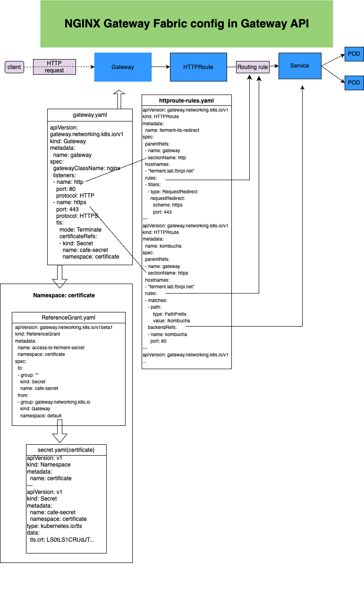

# HTTPs Termination Demo

This lab is intended for the instructors to demonstrate this use case using the instructions from
this page. Users can either watch or follow along using their own live environment.

## Introduction

In this demo we deploy a Fermentation Shop as the backend application.

This lab will be doing the following below.

- Configure **HTTPS** terminations for two URI paths.
- Redirect incoming port **80**, **HTTP** traffic to port **443**, **HTTPS** traffic.
- Configure **ReferenceGrant** such that it permits a **Gateway** to reference a **Secret** in a
  different **Namespace**.

## Demo Lab

1. Prepare the lab environment applications that act as the backend application servers.

    Copy and paste the following code snippet to deploy the Ferment application and service.

    This might be completed by the **Applications Developer**.

    > If you prefer to manually create and deploy this application, click [here](ferment-app.yaml) for the YAML file.

    ```bash
    kubectl create -f - <<EOF
    apiVersion: apps/v1
    kind: Deployment
    metadata:
      name: kombucha
    spec:
      replicas: 1
      selector:
        matchLabels:
          app: kombucha
      template:
        metadata:
          labels:
            app: kombucha
        spec:
          containers:
          - name: kombucha
            image: nginxdemos/nginx-hello:plain-text
            ports:
            - containerPort: 8080
    ---
    apiVersion: v1
    kind: Service
    metadata:
      name: kombucha
    spec:
      ports:
      - port: 80
        targetPort: 8080
        protocol: TCP
        name: http
      selector:
        app: kombucha
    ---
    apiVersion: apps/v1
    kind: Deployment
    metadata:
      name: kefir
    spec:
      replicas: 1
      selector:
        matchLabels:
          app: kefir
      template:
        metadata:
          labels:
            app: kefir
        spec:
          containers:
          - name: kefir
            image: nginxdemos/nginx-hello:plain-text
            ports:
            - containerPort: 8080
    ---
    apiVersion: v1
    kind: Service
    metadata:
      name: kefir
    spec:
      ports:
      - port: 80
        targetPort: 8080
        protocol: TCP
        name: http
      selector:
        app: kefir
    EOF
    ```

    Now check your new pod and service

    ```bash
    kubectl get pods,services -owide
    ```

    <details>
      <summary><b>Example output</b></summary>

      ```bash
      f5admin@bastion:~$ kubectl get pod,svc -owide
      NAME                            READY   STATUS    RESTARTS   AGE   IP               NODE                    NOMINATED NODE   READINESS GATES
      pod/kefir-74bf5f968-tcwrk       1/1     Running   0          11s   10.244.82.153    w2-mgmt.lab.f5npi.net   <none>           <none>
      pod/kombucha-7d9fd9c458-bp78m   1/1     Running   0          11s   10.244.191.144   w3-mgmt.lab.f5npi.net   <none>           <none>

      NAME                 TYPE        CLUSTER-IP      EXTERNAL-IP   PORT(S)   AGE   SELECTOR
      service/kefir        ClusterIP   10.97.22.60     <none>        80/TCP    11s   app=kefir
      service/kombucha     ClusterIP   10.107.183.96   <none>        80/TCP    11s   app=kombucha
      service/kubernetes   ClusterIP   10.96.0.1       <none>        443/TCP   10d   <none>
      ```

    </details>

2. Create a **Secret** that contains TLS certificate and key in it's own namespace

    Copy and paste the following snippet to create a secret in a new namespace that contains a TLS certificate and key.

    > If you prefer to manually create and deploy this, click [here](certificate-ns-and-cafe-secret.yaml) for the YAML file.

    ```bash
    kubectl apply -f - <<EOF
    apiVersion: v1
    kind: Namespace
    metadata:
      name: certificate
    ---
    apiVersion: v1
    kind: Secret
    metadata:
      name: cafe-secret
      namespace: certificate
    type: kubernetes.io/tls
    data:
      tls.crt: LS0tLS1CRUdJTiBDRVJUSUZJQ0FURS0tLS0tCk1JSUNzakNDQVpvQ0NRQzdCdVdXdWRtRkNEQU5CZ2txaGtpRzl3MEJBUXNGQURBYk1Sa3dGd1lEVlFRRERCQmoKWVdabExtVjRZVzF3YkdVdVkyOXRNQjRYRFRJeU1EY3hOREl4TlRJek9Wb1hEVEl6TURjeE5ESXhOVEl6T1ZvdwpHekVaTUJjR0ExVUVBd3dRWTJGbVpTNWxlR0Z0Y0d4bExtTnZiVENDQVNJd0RRWUpLb1pJaHZjTkFRRUJCUUFECmdnRVBBRENDQVFvQ2dnRUJBTHFZMnRHNFc5aStFYzJhdnV4Q2prb2tnUUx1ek10U1Rnc1RNaEhuK3ZRUmxIam8KVzFLRnMvQVdlS25UUStyTWVKVWNseis4M3QwRGtyRThwUisxR2NKSE50WlNMb0NEYUlRN0Nhck5nY1daS0o4Qgo1WDNnVS9YeVJHZjI2c1REd2xzU3NkSEQ1U2U3K2Vab3NPcTdHTVF3K25HR2NVZ0VtL1Q1UEMvY05PWE0zZWxGClRPL051MStoMzROVG9BbDNQdTF2QlpMcDNQVERtQ0thaEROV0NWbUJQUWpNNFI4VERsbFhhMHQ5Z1o1MTRSRzUKWHlZWTNtdzZpUzIrR1dYVXllMjFuWVV4UEhZbDV4RHY0c0FXaGRXbElweHlZQlNCRURjczN6QlI2bFF1OWkxZAp0R1k4dGJ3blVmcUVUR3NZdWxzc05qcU95V1VEcFdJelhibHhJZVVDQXdFQUFUQU5CZ2txaGtpRzl3MEJBUXNGCkFBT0NBUUVBcjkrZWJ0U1dzSnhLTGtLZlRkek1ISFhOd2Y5ZXFVbHNtTXZmMGdBdWVKTUpUR215dG1iWjlpbXQKL2RnWlpYVE9hTElHUG9oZ3BpS0l5eVVRZVdGQ2F0NHRxWkNPVWRhbUloOGk0Q1h6QVJYVHNvcUNOenNNLzZMRQphM25XbFZyS2lmZHYrWkxyRi8vblc0VVNvOEoxaCtQeDljY0tpRDZZU0RVUERDRGh1RUtFWXcvbHpoUDJVOXNmCnl6cEJKVGQ4enFyM3paTjNGWWlITmgzYlRhQS82di9jU2lyamNTK1EwQXg4RWpzQzYxRjRVMTc4QzdWNWRCKzQKcmtPTy9QNlA0UFlWNTRZZHMvRjE2WkZJTHFBNENCYnExRExuYWRxamxyN3NPbzl2ZzNnWFNMYXBVVkdtZ2todAp6VlZPWG1mU0Z4OS90MDBHUi95bUdPbERJbWlXMGc9PQotLS0tLUVORCBDRVJUSUZJQ0FURS0tLS0tCg==
      tls.key: LS0tLS1CRUdJTiBQUklWQVRFIEtFWS0tLS0tCk1JSUV2UUlCQURBTkJna3Foa2lHOXcwQkFRRUZBQVNDQktjd2dnU2pBZ0VBQW9JQkFRQzZtTnJSdUZ2WXZoSE4KbXI3c1FvNUtKSUVDN3N6TFVrNExFeklSNS9yMEVaUjQ2RnRTaGJQd0ZuaXAwMFBxekhpVkhKYy92TjdkQTVLeApQS1VmdFJuQ1J6YldVaTZBZzJpRU93bXF6WUhGbVNpZkFlVjk0RlAxOGtSbjl1ckV3OEpiRXJIUncrVW51L25tCmFMRHF1eGpFTVBweGhuRklCSnYwK1R3djNEVGx6TjNwUlV6dnpidGZvZCtEVTZBSmR6N3Rid1dTNmR6MHc1Z2kKbW9RelZnbFpnVDBJek9FZkV3NVpWMnRMZllHZWRlRVJ1VjhtR041c09va3R2aGxsMU1udHRaMkZNVHgySmVjUQo3K0xBRm9YVnBTS2NjbUFVZ1JBM0xOOHdVZXBVTHZZdFhiUm1QTFc4SjFINmhFeHJHTHBiTERZNmpzbGxBNlZpCk0xMjVjU0hsQWdNQkFBRUNnZ0VBQnpaRE50bmVTdWxGdk9HZlFYaHRFWGFKdWZoSzJBenRVVVpEcUNlRUxvekQKWlV6dHdxbkNRNlJLczUyandWNTN4cU9kUU94bTNMbjNvSHdNa2NZcEliWW82MjJ2dUczYnkwaVEzaFlsVHVMVgpqQmZCcS9UUXFlL2NMdngvSkczQWhFNmJxdFRjZFlXeGFmTmY2eUtpR1dzZk11WVVXTWs4MGVJVUxuRmZaZ1pOCklYNTlSOHlqdE9CVm9Sa3hjYTVoMW1ZTDFsSlJNM3ZqVHNHTHFybmpOTjNBdWZ3ZGRpK1VDbGZVL2l0K1EvZkUKV216aFFoTlRpNVFkRWJLVStOTnYvNnYvb2JvandNb25HVVBCdEFTUE05cmxFemIralQ1WHdWQjgvLzRGY3VoSwoyVzNpcjhtNHVlQ1JHSVlrbGxlLzhuQmZ0eVhiVkNocVRyZFBlaGlPM1FLQmdRRGlrR3JTOTc3cjg3Y1JPOCtQClpoeXltNXo4NVIzTHVVbFNTazJiOTI1QlhvakpZL2RRZDVTdFVsSWE4OUZKZnNWc1JRcEhHaTFCYzBMaTY1YjIKazR0cE5xcVFoUmZ1UVh0UG9GYXRuQzlPRnJVTXJXbDVJN0ZFejZnNkNQMVBXMEg5d2hPemFKZUdpZVpNYjlYTQoybDdSSFZOcC9jTDlYbmhNMnN0Q1lua2Iwd0tCZ1FEUzF4K0crakEyUVNtRVFWNXA1RnRONGcyamsyZEFjMEhNClRIQ2tTazFDRjhkR0Z2UWtsWm5ZbUt0dXFYeXNtekJGcnZKdmt2eUhqbUNYYTducXlpajBEdDZtODViN3BGcVAKQWxtajdtbXI3Z1pUeG1ZMXBhRWFLMXY4SDNINGtRNVl3MWdrTWRybVJHcVAvaTBGaDVpaGtSZS9DOUtGTFVkSQpDcnJjTzhkUVp3S0JnSHA1MzRXVWNCMVZibzFlYStIMUxXWlFRUmxsTWlwRFM2TzBqeWZWSmtFb1BZSEJESnp2ClIrdzZLREJ4eFoyWmJsZ05LblV0YlhHSVFZd3lGelhNcFB5SGxNVHpiZkJhYmJLcDFyR2JVT2RCMXpXM09PRkgKcmppb21TUm1YNmxhaDk0SjRHU0lFZ0drNGw1SHhxZ3JGRDZ2UDd4NGRjUktJWFpLZ0w2dVJSSUpBb0dCQU1CVApaL2p5WStRNTBLdEtEZHUrYU9ORW4zaGxUN3hrNXRKN3NBek5rbWdGMU10RXlQUk9Xd1pQVGFJbWpRbk9qbHdpCldCZ2JGcXg0M2ZlQ1Z4ZXJ6V3ZEM0txaWJVbWpCTkNMTGtYeGh3ZEVteFQwVit2NzZGYzgwaTNNYVdSNnZZR08KditwVVovL0F6UXdJcWZ6dlVmV2ZxdStrMHlhVXhQOGNlcFBIRyt0bEFvR0FmQUtVVWhqeFU0Ym5vVzVwVUhKegpwWWZXZXZ5TW54NWZyT2VsSmRmNzlvNGMvMHhVSjh1eFBFWDFkRmNrZW96dHNpaVFTNkN6MENRY09XVWxtSkRwCnVrdERvVzM3VmNSQU1BVjY3NlgxQVZlM0UwNm5aL2g2Tkd4Z28rT042Q3pwL0lkMkJPUm9IMFAxa2RjY1NLT3kKMUtFZlNnb1B0c1N1eEpBZXdUZmxDMXc9Ci0tLS0tRU5EIFBSSVZBVEUgS0VZLS0tLS0K
    EOF
    ```

    A **Secret** is created with a certificate installed named **cafe-secret** in namespace **certificate**. *This could be the responsibility of the **cluster administrator**. Now verify the new secret in a new namespace.

    ```bash
    kubectl -n certificate get secrets
    kubectl -n certificate describe secrets cafe-secret
    ```

    <details>
      <summary><b>Example output</b></summary>

      ```bash
      f5admin@bastion:~$ kubectl -n certificate get secrets
      NAME          TYPE                DATA   AGE
      cafe-secret   kubernetes.io/tls   2      3m22s

      f5admin@bastion:~$ kubectl -n certificate describe secrets cafe-secret
      Name:         cafe-secret
      Namespace:    certificate
      Labels:       <none>
      Annotations:  <none>

      Type:  kubernetes.io/tls

      Data
      ====
      tls.crt:  997 bytes
      tls.key:  1704 bytes
      ```

    </details>

3. Create a Gateway resource to enable incoming traffic into NGF based on the following criteria.

    | Protocol       | Port      |
    | -------------- | --------- |
    | `HTTP`         | `80`      |
    | `HTTPS`        | `443`     |

    Copy and paste the following code snippet to deploy the Ferment Gateway.

    > If you prefer to manually create this, click [here](ferment-gateway.yaml) for the YAML file.

    ```bash
    kubectl apply -f - <<EOF
    apiVersion: gateway.networking.k8s.io/v1
    kind: Gateway
    metadata:
      name: ferment-gateway
    spec:
      gatewayClassName: nginx
      listeners:
      - name: http
        port: 80
        protocol: HTTP
      - name: https
        port: 443
        protocol: HTTPS
        tls:
          mode: Terminate
          certificateRefs:
          - kind: Secret
            name: cafe-secret
            namespace: certificate
    EOF
    ```

    Check the new **ferment-gateway** health.

    ```bash
    kubectl get gateways ferment-gateway
    kubectl describe gateways ferment-gateway
    ```

    <details>
      <summary><b>Example output</b></summary>

      ```bash
      f5admin@bastion:~$ kubectl get gateways ferment-gateway
      NAME              CLASS   ADDRESS       PROGRAMMED   AGE
      ferment-gateway   nginx   10.1.10.100   True         7s

      f5admin@bastion:~$ kubectl describe gateways ferment-gateway
      Name:         ferment-gateway
      Namespace:    default
      Labels:       <none>
      Annotations:  <none>
      API Version:  gateway.networking.k8s.io/v1
      Kind:         Gateway
      Metadata:
        Creation Timestamp:  2024-07-16T07:08:52Z
        Generation:          1
        Resource Version:    153978
        UID:                 6edae5d2-05ca-445d-8148-c4e1712e50d1
      Spec:
        Gateway Class Name:  nginx
        Listeners:
          Allowed Routes:
            Namespaces:
              From:  Same
          Name:      http
          Port:      80
          Protocol:  HTTP
          Allowed Routes:
            Namespaces:
              From:  Same
          Name:      https
          Port:      443
          Protocol:  HTTPS
          Tls:
            Certificate Refs:
              Group:
              Kind:       Secret
              Name:       cafe-secret
              Namespace:  certificate
            Mode:         Terminate
      Status:
        Addresses:
          Type:   IPAddress
          Value:  10.1.10.100
        Conditions:
          Last Transition Time:  2024-07-16T07:08:52Z
          Message:               Gateway is accepted
          Observed Generation:   1
          Reason:                Accepted
          Status:                True
          Type:                  Accepted
          Last Transition Time:  2024-07-16T07:08:52Z
          Message:               Gateway is programmed
          Observed Generation:   1
          Reason:                Programmed
          Status:                True
          Type:                  Programmed
        Listeners:
          Attached Routes:  0
          Conditions:
            Last Transition Time:  2024-07-16T07:08:52Z
            Message:               Listener is accepted
            Observed Generation:   1
            Reason:                Accepted
            Status:                True
            Type:                  Accepted
            Last Transition Time:  2024-07-16T07:08:52Z
            Message:               Listener is programmed
            Observed Generation:   1
            Reason:                Programmed
            Status:                True
            Type:                  Programmed
            Last Transition Time:  2024-07-16T07:08:52Z
            Message:               All references are resolved
            Observed Generation:   1
            Reason:                ResolvedRefs
            Status:                True
            Type:                  ResolvedRefs
            Last Transition Time:  2024-07-16T07:08:52Z
            Message:               No conflicts
            Observed Generation:   1
            Reason:                NoConflicts
            Status:                False
            Type:                  Conflicted
          Name:                    http
          Supported Kinds:
            Group:          gateway.networking.k8s.io
            Kind:           HTTPRoute
          Attached Routes:  0
          Conditions:
            Last Transition Time:  2024-07-16T07:08:52Z
            Message:               Listener is accepted
            Observed Generation:   1
            Reason:                Accepted
            Status:                True
            Type:                  Accepted
            Last Transition Time:  2024-07-16T07:08:52Z
            Message:               Listener is programmed
            Observed Generation:   1
            Reason:                Programmed
            Status:                True
            Type:                  Programmed
            Last Transition Time:  2024-07-16T07:08:52Z
            Message:               All references are resolved
            Observed Generation:   1
            Reason:                ResolvedRefs
            Status:                True
            Type:                  ResolvedRefs
            Last Transition Time:  2024-07-16T07:08:52Z
            Message:               No conflicts
            Observed Generation:   1
            Reason:                NoConflicts
            Status:                False
            Type:                  Conflicted
          Name:                    https
          Supported Kinds:
            Group:  gateway.networking.k8s.io
            Kind:   HTTPRoute
      Events:       <none>

      ```

    </details>

4. Create the **ReferenceGrant** which permits the **Gateway** in the **default** namespace to
   access the **cafe-secret** Secret in the **certificate** namespace.

    Copy and paste the following code snippet to create the **ReferenceGrant**.

    > If you prefer to manually create and deploy this, click [here](ferment-reference-grant.yaml) for the YAML file.

    ```bash
    kubectl apply -f - <<EOF
    apiVersion: gateway.networking.k8s.io/v1beta1
    kind: ReferenceGrant
    metadata:
      name: access-to-ferment-secret
      namespace: certificate
    spec:
      to:
      - group: ""
        kind: Secret
        name: cafe-secret # if you omit this name, then Gateways in default ns can access all Secrets in the certificate ns
      from:
      - group: gateway.networking.k8s.io
        kind: Gateway
        namespace: default
    EOF
    ```

    Check the new referenceGrant health.

    ```bash
    kubectl -n certificate get referencegrants access-to-ferment-secret
    kubectl -n certificate describe referencegrants access-to-ferment-secret
    ```

    <details>
      <summary><b>Example output</b></summary>

      ```bash
      f5admin@bastion:~$ kubectl -n certificate get referencegrants access-to-ferment-secret
      NAME                       AGE
      access-to-ferment-secret   7m13s

      f5admin@bastion:~$ kubectl -n certificate describe referencegrants access-to-ferment-secret
      Name:         access-to-ferment-secret
      Namespace:    certificate
      Labels:       <none>
      Annotations:  <none>
      API Version:  gateway.networking.k8s.io/v1beta1
      Kind:         ReferenceGrant
      Metadata:
        Creation Timestamp:  2024-07-16T06:59:32Z
        Generation:          1
        Resource Version:    152518
        UID:                 bd24d828-fec9-4570-b81e-404164255537
      Spec:
        From:
          Group:      gateway.networking.k8s.io
          Kind:       Gateway
          Namespace:  default
        To:
          Group:
          Kind:   Secret
          Name:   cafe-secret
      Events:     <none>

      ```

    </details>

5. Create **HTTPRoute** resources that does the following below
    - Redirecting HTTP traffic to HTTPS
    - Handle HTTPS traffic to `/kombucha`
    - Handle HTTPS traffic to `/kefir`

    Copy and paste the following code snippet to create two HTTPRoute.

    > If you prefer to manually create this, click [here](ferment-routes.yaml) for the YAML file.

    ```bash
    kubectl apply -f - <<EOF
    apiVersion: gateway.networking.k8s.io/v1
    kind: HTTPRoute
    metadata:
      name: ferment-tls-redirect
    spec:
      parentRefs:
      - name: ferment-gateway
        sectionName: http
      hostnames:
      - "ferment.lab.f5npi.net"
      rules:
      - filters:
        - type: RequestRedirect
          requestRedirect:
            scheme: https
            port: 443
    ---
    apiVersion: gateway.networking.k8s.io/v1
    kind: HTTPRoute
    metadata:
      name: kombucha
    spec:
      parentRefs:
      - name: ferment-gateway
        sectionName: https
      hostnames:
      - "ferment.lab.f5npi.net"
      rules:
      - matches:
        - path:
            type: PathPrefix
            value: /kombucha
        backendRefs:
        - name: kombucha
          port: 80
    ---
    apiVersion: gateway.networking.k8s.io/v1
    kind: HTTPRoute
    metadata:
      name: kefir
    spec:
      parentRefs:
      - name: ferment-gateway
        sectionName: https
      hostnames:
      - "ferment.lab.f5npi.net"
      rules:
      - matches:
        - path:
            type: PathPrefix
            value: /kefir
        backendRefs:
        - name: kefir
          port: 80
    EOF
    ```

    ```bash
    kubectl get httproutes kombucha
    ```

    <details>
      <summary><b>Example output</b></summary>

      ```bash
      f5admin@bastion:~$ kubectl get httproutes
      NAME                   HOSTNAMES                   AGE
      ferment-tls-redirect   ["ferment.lab.f5npi.net"]   19s
      kefir                  ["ferment.lab.f5npi.net"]   19s
      kombucha               ["ferment.lab.f5npi.net"]   19s
      ```

    </details>

    We have three **httpRoutes** objects.

    - **kefir** will handle TLS port 443 requests to hostname `ferment.lab.f5net.net` with path starting `/kefir`
    - **kombucha** will handle TLS port 443 requests to hostname `ferment.lab.f5npi.net` with path starting `/kombucha`
    - **ferment-tls-redirect** will redirect port **80** to make new request on port **443**

<details>
  <summary><h3>HTTPS Termination Diagram and Additional Details</h3></summary>



Now that this use case is configured, we now have a configuration that looks like the diagram
above.

1. We see the YAML configuration of the Kubernetes **Gateway** and **HTTPRoute**
resource.

    - In the **Gateway** resource, there are two sections:
      - The first is named **http** and triggers on port 80 HTTP traffic. This is used to redirect
        port 80 traffic to port 443.
      - The second section, **https** triggers on port 443 HTTPS traffic. It includes a **tls** section
        that encrypts the client-side traffic.
    - In the **HTTPRoute** resource, we define rules for how incoming traffic should be handled.
      These rules reference a **listener** defined in the **Gateway** resource.

2. The top of the diagram show when data traffic is evaluated as it travels from the **client** to
the **POD**, the backend application. For this case, traffic arrives and is handled by the
**Gateway**. If traffic matches the criteria of a **listener** from the **Gateway**, it then
proceeds to the **HTTPRoute** resource. If traffic matches a **rule**, it finally arrives to the
**POD**. Below are a couple different traffic examples.

    - If port **80** traffic arrives, and matches the hostname header value of
    **ferment.labs.f5npi.net**, the client will receive a 302 response. The redirect 302 response will
    include a **Location** header specifying the **HTTPS** protocol instead of **HTTP**.
    - If port **443** traffic arrives, and matches the hostname header value of
    **ferment.labs.f5npi.net**, it will be forwarded to the one of the two backend applications: either
    it goes to **kombucha** or **kefir**.

3. A **Secret** resource holds the SSL **certificate** and **key** for the **https** listener from
the **Gateway**. To allow the **Gateway** in the `default` namespace access to the **Secret**
located in the `certificate` namespace, a **ReferenceGrant** resource is required.

</details>

## Test Application

We can now test the application to validate the following behavior.

1. Confirm HTTPS traffic to **kombucha** and **kefir**
2. Confirm redirecting HTTP traffic to HTTPS traffic

### Confirm HTTPS Termination to Kombucha

The **HTTPRoutes** resource named **kombucha** handles incoming HTTPS traffic with the
`ferment.lab.f5npi.net` hostname and the **/kombucha** path. Lets confirm HTTPS termination.

```bash
curl --insecure https://ferment.lab.f5npi.net/kombucha
```

<details>
  <summary><b>Example output</b></summary>

  Below is a successful HTTPS request.

  ```bash
  f5admin@bastion:~$ curl --insecure https://ferment.lab.f5npi.net/kombucha
  Server address: 10.244.191.140:8080
  Server name: kombucha-5f657f8dd8-69jgb
  Date: 09/Jul/2024:21:45:53 +0000
  URI: /kombucha
  Request ID: 1ffbdba83e2a8238e8352d00fade100d
  f5admin@bastion:~$
  ```

</details>

### Confirm HTTPS Termination to Kefir

The **HTTPRoutes** resource named **kefir** handles incoming HTTPS traffic with the
`ferment.lab.f5npi.net` hostname and the **/kefir** path. Lets confirm HTTPS termination.

```bash
curl --insecure https://ferment.lab.f5npi.net/kefir
```

<details>
  <summary><b>Example output</b></summary>

  Below is a successful HTTPS request.

  ```bash
  f5admin@bastion:~$ curl --insecure https://ferment.lab.f5npi.net/kefir
  Server address: 10.244.82.142:8080
  Server name: kefir-74bf5f968-c8jhd
  Date: 09/Jul/2024:21:48:12 +0000
  URI: /kefir
  Request ID: a7556233a9026d936c475dcf814d595c
  ```

</details>

### Redirect HTTP to HTTPS

The **HTTPRoutes** resource named **ferment-tls-redirect** handles the HTTP to HTTPS redirects.
NGF will respond with an HTTP 302 Redirect for incoming HTTP request with the
`ferment.lab.f5npi.net` hostname.

Lets give it a try by using `curl` with the `--head` option to only return headers.

```bash
curl --head http://ferment.lab.f5npi.net/kombucha
```

<details>
  <summary><b>Example output</b></summary>

  ```bash
  f5admin@bastion:~$ curl -I http://ferment.lab.f5npi.net/kombucha
  HTTP/1.1 302 Moved Temporarily
  Server: nginx/1.27.0
  Date: Tue, 09 Jul 2024 21:43:24 GMT
  Content-Type: text/html
  Content-Length: 145
  Connection: keep-alive
  Location: https://ferment.lab.f5npi.net/kombucha
  ```

  We can see the **Location** header that has the HTTPS protocol. Notice that the URL uses
  **https** instead of **http**. The resulting HTTPS requests is then handled by either the
  **kefir** or **kombucha** HTTPRoute.

</details>

Now, lets add the `--location` switch to the `curl` command to follow the redirect. This results
in a TLS request to **<https://ferment.lab.f5npi.net/kombucha>**.

```bash
curl --insecure --head --location http://ferment.lab.f5npi.net/kombucha
```

<details>
  <summary><b>Example output</b></summary>

  Here we see the headers from first request in HTTP and the headers from the followup request
  in HTTPS.

  ```bash
  f5admin@bastion:~$ curl --insecure --head --location http://ferment.lab.f5npi.net/kombucha
  HTTP/1.1 302 Moved Temporarily
  Server: nginx/1.27.0
  Date: Tue, 09 Jul 2024 23:09:15 GMT
  Content-Type: text/html
  Content-Length: 145
  Connection: keep-alive
  Location: https://ferment.lab.f5npi.net/kombucha

  HTTP/2 200
  server: nginx/1.27.0
  date: Tue, 09 Jul 2024 23:09:15 GMT
  content-type: text/plain
  content-length: 160
  expires: Tue, 09 Jul 2024 23:09:14 GMT
  cache-control: no-cache
  ```

</details>

And finally, we can see the response by omitting the `--head` option from the `curl` command.

```bash
curl --insecure --location http://ferment.lab.f5npi.net/kombucha
```

<details>
  <summary><b>Example output</b></summary>

  We now see the same response as the HTTPS request.

  ```bash
  f5admin@bastion:~$ curl --insecure --location http://ferment.lab.f5npi.net/kombucha
  Server address: 10.244.191.140:8080
  Server name: kombucha-5f657f8dd8-69jgb
  date: Tue, 09 Jul 2024 23:19:25 GMT
  URI: /kombucha
  Request ID: 89a330d1e1dc0596c0d3fe65712ede31
  ```

</details>

You can also repeat this exercise using the will see similar response using the **kefir** route.

```bash
curl --head http://ferment.lab.f5npi.net/kefir
curl --insecure --head --location http://ferment.lab.f5npi.net/kefir
curl --insecure --location http://ferment.lab.f5npi.net/kefir
```

<details>
  <summary><b>Example output</b></summary>

  We now see the same response as the HTTPS request.

  ```bash
  f5admin@bastion:~$ curl --head http://ferment.lab.f5npi.net/kefir
  HTTP/1.1 302 Moved Temporarily
  Server: nginx/1.27.0
  Date: Wed, 17 Jul 2024 22:02:25 GMT
  Content-Type: text/html
  Content-Length: 145
  Connection: keep-alive
  Location: https://ferment.lab.f5npi.net/kefir

  f5admin@bastion:~$ curl --insecure --head --location http://ferment.lab.f5npi.net/kefir
  HTTP/1.1 302 Moved Temporarily
  Server: nginx/1.27.0
  Date: Wed, 17 Jul 2024 22:02:41 GMT
  Content-Type: text/html
  Content-Length: 145
  Connection: keep-alive
  Location: https://ferment.lab.f5npi.net/kefir

  HTTP/2 200
  server: nginx/1.27.0
  date: Wed, 17 Jul 2024 22:02:41 GMT
  content-type: text/plain
  content-length: 160
  expires: Wed, 17 Jul 2024 22:02:40 GMT
  cache-control: no-cache

  f5admin@bastion:~$ curl --insecure --location http://ferment.lab.f5npi.net/kefir
  Server address: 10.244.82.142:8080
  Server name: kefir-74bf5f968-c8jhd
  Date: 17/Jul/2024:22:02:46 +0000
  URI: /kefir
  Request ID: 0bfc98f522867a3c5892354362f94906
  ```

</details>

## Clean up

When done with this lab you can clean up the objects by running the following commands.

```bash
kubectl delete deployments kefir kombucha
kubectl delete services kombucha kefir
kubectl delete ns certificate
kubectl delete gateway ferment-gateway
kubectl delete httproutes ferment-tls-redirect kombucha kefir
```

## Source files

Here are the configuration files in the event that you want to manually go through this lab.

- [ferment-app.yaml](ferment-app.yaml)
- [ferment-gateway.yaml](ferment-gateway.yaml)
- [ferment-reference-grant.yaml](ferment-reference-grant.yaml)
- [certificate-ns-and-cafe-secret.yaml](certificate-ns-and-cafe-secret.yaml)
- [ferment-routes.yaml](ferment-routes.yaml)

Previous: [SDE NGINX Gateway Fabric](../README.md)

Next: [Interactive Lab](../lab/README.md)

---

## End of lab
