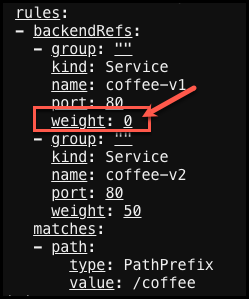

# Coffee demo with traffic splitting

## Introduction

In this demo we are going to deploy the [Coffee application and service](coffee-v1-and-v2.yaml) to the default namespace. This Coffee application creates two deployments, one called **coffee-v1** and the other **coffee-v2**. The gateway object and HTTPRoute will be deployed to the default namespace also. This is a task that might be completed by the **Applications Developer**.

## Demo: Split Using Weights

Copy and paste the following to deploy the **coffee** applications and services.

```yaml
kubectl create -f - <<EOF
apiVersion: apps/v1
kind: Deployment
metadata:
  name: coffee-v1
spec:
  replicas: 1
  selector:
    matchLabels:
      app: coffee-v1
  template:
    metadata:
      labels:
        app: coffee-v1
    spec:
      containers:
      - name: coffee-v1
        image: nginxdemos/nginx-hello:plain-text
        ports:
        - containerPort: 8080
---
apiVersion: v1
kind: Service
metadata:
  name: coffee-v1
spec:
  ports:
  - port: 80
    targetPort: 8080
    protocol: TCP
    name: http
  selector:
    app: coffee-v1
---
apiVersion: apps/v1
kind: Deployment
metadata:
  name: coffee-v2
spec:
  replicas: 1
  selector:
    matchLabels:
      app: coffee-v2
  template:
    metadata:
      labels:
        app: coffee-v2
    spec:
      containers:
      - name: coffee-v2
        image: nginxdemos/nginx-hello:plain-text
        ports:
        - containerPort: 8080
---
apiVersion: v1
kind: Service
metadata:
  name: coffee-v2
spec:
  ports:
  - port: 80
    targetPort: 8080
    protocol: TCP
    name: http
  selector:
    app: coffee-v2
EOF
```

Now check your new pod and service in the **default** namespace.

```bash
kubectl get pod,svc -owide
```

<details><summary>Example output</summary>

  ```bash
  f5admin@bastion:~$ kubectl get pod,svc -owide
NAME                             READY   STATUS    RESTARTS   AGE   IP              NODE                    NOMINATED NODE   READINESS GATES
pod/coffee-v1-76c7c85bbd-lwnn4   1/1     Running   0          17s   10.244.67.147   w1-mgmt.lab.f5npi.net   <none>           <none>
pod/coffee-v2-7d47fc86cb-lflhk   1/1     Running   0          17s   10.244.67.148   w1-mgmt.lab.f5npi.net   <none>           <none>

NAME                 TYPE        CLUSTER-IP       EXTERNAL-IP   PORT(S)   AGE   SELECTOR
service/coffee-v1    ClusterIP   10.104.172.246   <none>        80/TCP    17s   app=coffee-v1
service/coffee-v2    ClusterIP   10.105.78.161    <none>        80/TCP    16s   app=coffee-v2
service/kubernetes   ClusterIP   10.96.0.1        <none>        443/TCP   9d    <none>
  ```

</details>

&nbsp;

-------------------

&nbsp;

Next we will create an [NGINX Gateway Fabric gateway](cafe-gateway.yaml) object that will enable traffic into the default namespace based on the following criteria.

| Name                   | Value     |
| ---------------------- | -------   |
| **port**               | `80`      |
| **protocol**           | `HTTP` |
| **hostname**           | `*.lab.f5npi.net`   |

This could be the responsibility of the **cluster administrator**.

Copy and paste the following code snippet to deploy the coffee gateway.

```yaml
kubectl create -f - <<EOF
apiVersion: gateway.networking.k8s.io/v1
kind: Gateway
metadata:
  name: cafe-gateway
spec:
  gatewayClassName: nginx
  listeners:
  - name: http
    port: 80
    protocol: HTTP
    hostname: '*.lab.f5npi.net'
EOF
```

Check the new cafe-gateway health.

```bash
kubectl get gateways cafe-gateway
kubectl describe gateways cafe-gateway
```

&nbsp;

<details><summary>Example output</summary>

  ```bash
  f5admin@bastion:~$ kubectl get gateways cafe-gateway
NAME           CLASS   ADDRESS       PROGRAMMED   AGE
cafe-gateway   nginx   10.1.10.100   True         27s

f5admin@bastion:~$ kubectl describe gateways cafe-gateway
Name:         cafe-gateway
Namespace:    default
Labels:       <none>
Annotations:  <none>
API Version:  gateway.networking.k8s.io/v1
Kind:         Gateway
Metadata:
  Creation Timestamp:  2024-07-15T21:11:52Z
  Generation:          1
  Resource Version:    121761
  UID:                 27e21ddf-3c47-4189-aa4e-d37eb32fdacb
Spec:
  Gateway Class Name:  nginx
  Listeners:
    Allowed Routes:
      Namespaces:
        From:  Same
    Hostname:  cafe.lab.f5npi.net
    Name:      http
    Port:      80
    Protocol:  HTTP
Status:
  Addresses:
    Type:   IPAddress
    Value:  10.1.10.100
  Conditions:
    Last Transition Time:  2024-07-15T21:11:53Z
    Message:               Gateway is accepted
    Observed Generation:   1
    Reason:                Accepted
    Status:                True
    Type:                  Accepted
    Last Transition Time:  2024-07-15T21:11:53Z
    Message:               Gateway is programmed
    Observed Generation:   1
    Reason:                Programmed
    Status:                True
    Type:                  Programmed
  Listeners:
    Attached Routes:  0
    Conditions:
      Last Transition Time:  2024-07-15T21:11:53Z
      Message:               Listener is accepted
      Observed Generation:   1
      Reason:                Accepted
      Status:                True
      Type:                  Accepted
      Last Transition Time:  2024-07-15T21:11:53Z
      Message:               Listener is programmed
      Observed Generation:   1
      Reason:                Programmed
      Status:                True
      Type:                  Programmed
      Last Transition Time:  2024-07-15T21:11:53Z
      Message:               All references are resolved
      Observed Generation:   1
      Reason:                ResolvedRefs
      Status:                True
      Type:                  ResolvedRefs
      Last Transition Time:  2024-07-15T21:11:53Z
      Message:               No conflicts
      Observed Generation:   1
      Reason:                NoConflicts
      Status:                False
      Type:                  Conflicted
    Name:                    http
    Supported Kinds:
      Group:  gateway.networking.k8s.io
      Kind:   HTTPRoute
Events:       <none>

  ```

</details>

&nbsp;

------------------

&nbsp;

Next we will create the [HTTPRoute](coffee-50-50-httpRoute.yaml) that will add weighting to the distribution of traffic to the backend PODs. The important value here is **weight**. The httpRoute object will also define the path uri of **/coffee** and backend service (POD) to route traffic to.

>**Note**: Weight is an optional parameter and if not specified, defaults to 1. The weights are calculated proportionally and do not need to sum to 100. For example, the weights of 8 and 2, 16 and 4, or 32 and 8 all evaluate to the same relative proportions. A weight of 0 means "never use this backendRef".

Copy and paste the following code snippet to deploy the HTTPRoute.

```yaml
kubectl create -f - <<EOF
apiVersion: gateway.networking.k8s.io/v1
kind: HTTPRoute
metadata:
  name: coffee-httproute
spec:
  parentRefs:
  - name: cafe-gateway
    sectionName: http
  hostnames:
  - "cafe.lab.f5npi.net"
  rules:
  - matches:
    - path:
        type: PathPrefix
        value: /coffee
    backendRefs:
    - name: coffee-v1
      port: 80
      weight: 5
    - name: coffee-v2
      port: 80
      weight: 5
EOF
```

Check the new httpRoute health.

```bash
kubectl get httproutes coffee-httproute
kubectl describe httproutes coffee-httproute
```

&nbsp;

<details><summary>Example output</summary>

  ```bash
  f5admin@bastion:~$ kubectl get httproutes coffee-httproute
NAME               HOSTNAMES                  AGE
coffee-httproute   ["cafe.lab.f5npi.net"]   21s
  ```

</details>

&nbsp;

-------------

&nbsp;

## Testing 50/50 split

Notice how the httpRoute configuration has two `backendRefs`, each with a weight of `5`. Test the newly exposed application deployed that is linked to the **cafe-gateway** object.  We should find that our connections are distributed evenly between the two versions.

Now run a couple quick manual tests to see which application backend traffic is routed to based on our weighting.

```bash
curl http://cafe.lab.f5npi.net/coffee
curl http://cafe.lab.f5npi.net/coffee
curl http://cafe.lab.f5npi.net/coffee
```

Now we can run this bash one-liner will perform 100 web requests and count how many replies include the text `v1`, indicating that the request hit the v1 service.

```bash
{ for i in $(seq 1 100); do curl -s "http://cafe.lab.f5npi.net/coffee"; done } | grep -c v1
```

Repeat we will repeat this command, but change "v1" to "v2".

```bash
{ for i in $(seq 1 100); do curl -s "http://cafe.lab.f5npi.net/coffee"; done } | grep -c v2
```

You should notice that the requests are relatively equal between the v1 and v2 responses.

<details><summary>Example output</summary>

```bash
f5admin@bastion:~$ { for i in $(seq 1 100); do curl -s "http://cafe.lab.f5npi.net/coffee"; done } | grep -c v1
51
f5admin@bastion:~$ { for i in $(seq 1 100); do curl -s "http://cafe.lab.f5npi.net/coffee"; done } | grep -c v2
48
  ```

</details>

## Modify Weight and disable coffee-v1

Now we want to send all traffic to coffee-v2. Let's modify ```coffee-v1``` to disable this service. We will do this by changing the ```weight``` value from 5 to ```0```.

```bash
kubectl edit httproutes coffee-httproute
```



Save the file, then test your connections again and you should notice that you are only being routed to coffee-v2.

<details><summary>Example output</summary>

```bash
f5admin@bastion:~$ { for i in $(seq 1 100); do curl -s "http://cafe.lab.f5npi.net/coffee"; done } | grep -c v1
0
f5admin@bastion:~$ { for i in $(seq 1 100); do curl -s "http://cafe.lab.f5npi.net/coffee"; done } | grep -c v2
100
  ```

</details>

&nbsp;

----

&nbsp;

## Routing based on HTTP Method

Next, we'll imagine that the cafe web app has two services.

- `coffee-v1` handles static content
- `coffee-v2` handles POSTed incoming data and has dynamic content

We'll use the same gateway, deployment, and services with a new HTTPRoute object that performs HTTP routing based on **Request Method**.

First, delete the route:

```bash
kubectl delete httproute coffee-httproute
```

Next, create the new route:

```yaml
kubectl create -f - <<EOF
apiVersion: gateway.networking.k8s.io/v1
kind: HTTPRoute
metadata:
  name: coffee-httproute
spec:
  parentRefs:
  - name: cafe-gateway
    sectionName: http
  hostnames:
  - "cafe.lab.f5npi.net"
  rules:
  - matches:
    - method: "GET"
    backendRefs:
    - name: coffee-v1
      port: 80
  - matches:
    - method: "POST"
    backendRefs:
    - name: coffee-v2
      port: 80
EOF
```

Now test the route by sending a GET and a POST request.

Method: GET

 ```bash
 curl cafe.lab.f5npi.net
 ```

Method: POST

```bash
curl -d foo cafe.lab.f5npi.net
```

<details><summary>Example output</summary>

```bash
root@bastion:/# curl cafe.lab.f5npi.net
Server address: 10.244.67.154:8080
Server name: coffee-v1-76c7c85bbd-54q42
Date: 20/Jul/2024:23:05:56 +0000
URI: /
Request ID: 32fbf0ba4c657e063355f11717e8fa9b
root@bastion:/# curl -d foo cafe.lab.f5npi.net
Server address: 10.244.67.155:8080
Server name: coffee-v2-7d47fc86cb-wl4hw
Date: 20/Jul/2024:23:06:00 +0000
URI: /
Request ID: 71f5f148cb2718d5f37c47b3000577da
```

</details>

&nbsp;

We can see that using a GET results in a response from coffee-v1 and a POST (```-d foo```) results in a response from coffee-v2.

----

&nbsp;

We've seen how we can route with methods and weights.

## Routing based on HTTP Header

Let's use a different HTTPRoute so we can route with a custom HTTP header.

First we are going to remove the existing HTTPRoute and then create a new HTTPRoute.

```bash
kubectl delete httproutes coffee-httproute
```

Copy and paste the following code snippet to deploy the HTTPRoute. This configuration causes requests with a header `ver: 1` to be routed to the coffee-v1 service and `ver: 2` to be routed to the coffee-v2 service.

```yaml
kubectl create -f - <<EOF
apiVersion: gateway.networking.k8s.io/v1
kind: HTTPRoute
metadata:
  name: coffee-httproute
spec:
  parentRefs:
  - name: cafe-gateway
    sectionName: http
  hostnames:
  - "cafe.lab.f5npi.net"
  rules:
  - backendRefs:
    - name: coffee-v1
      port: 80
    matches:
    - headers:
      - name: ver
        value: "1"
  - backendRefs:
    - name: coffee-v2
      port: 80
    matches:
    - headers:
      - name: ver
        value: "2"
  - backendRefs:
    - name: coffee-v1
      port: 80
EOF
```

Try to curl against this new HTTPRoute

```bash
curl cafe.lab.f5npi.net
curl -H 'ver: 1' cafe.lab.f5npi.net
curl -H 'ver: 2' cafe.lab.f5npi.net
```

Notice that we now have a default application backend when we are not passing in a header value.

Take a moment to analyze the YAML configuration's spec using the `k get httproutes coffee-httproute -oyaml`.

Notice how the "no header" match we just added was transformed to  **PathPrefix "/"**, this was *implied* by Kubernetes:

<details><summary>Example output</summary>

```bash
root@bastion:/# k get httproutes coffee-httproute -oyaml
apiVersion: gateway.networking.k8s.io/v1
kind: HTTPRoute
metadata:
  creationTimestamp: "2024-07-20T00:15:25Z"
  generation: 3
  name: coffee-httproute
  namespace: default
  resourceVersion: "196311"
  uid: 958f3ddb-3ca8-4ad1-b74c-dfe3bcfe1718
spec:
  hostnames:
  - cafe.lab.f5npi.net
  parentRefs:
  - group: gateway.networking.k8s.io
    kind: Gateway
    name: cafe-gateway
    sectionName: http
  rules:
  - backendRefs:
    - group: ""
      kind: Service
      name: coffee-v1
      port: 80
      weight: 1
    matches:
    - headers:
      - name: ver
        type: Exact
        value: "1"
      path:
        type: PathPrefix
        value: /
  - backendRefs:
    - group: ""
      kind: Service
      name: coffee-v2
      port: 80
      weight: 1
    matches:
    - headers:
      - name: ver
        type: Exact
        value: "2"
      path:
        type: PathPrefix
        value: /
  - backendRefs:
    - group: ""
      kind: Service
      name: coffee-v1
      port: 80
      weight: 1
    matches:
    - path:
        type: PathPrefix
        value: /
```

</details>

-----------

## Summary

You should now have additional understanding of how httpRoutes matches are handled by Kubernetes and NGF.

## Clean up

When done with this lab you can clean up the objects by running the following commands.

```bash
kubectl delete deployments.apps coffee-v1 coffee-v2
kubectl delete service coffee-v1 coffee-v2
kubectl delete gateways cafe-gateway
kubectl delete httproutes.gateway coffee-httproute
```

Previous: [SDE NGINX Gateway Fabric](../README.md)

Next: [Interactive Lab](../lab/README.md)

---

## End of lab
